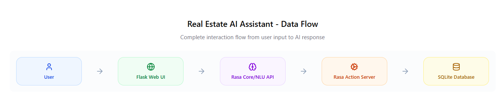

# Real Estate AI Assistant: Automated Lead Qualification & Property Inquiry System

## 🌟 Project Overview

This project introduces a foundational AI-powered conversational agent designed to significantly enhance the operational efficiency of a small to medium-sized real estate firm, particularly within the dynamic Indian market. Moving beyond the scope of a full CRM, this solution targets a critical business pain point: automating the initial stages of lead qualification and providing instant, accurate responses to common property inquiries.

By serving as the primary digital touchpoint, this AI assistant empowers human agents to reallocate their valuable time from repetitive tasks to high-value interactions and core sales activities, ultimately driving productivity and improving customer response times.

**Key Capabilities:**

*   **Intelligent Property Inquiry Handling:** Answers questions about properties by ID, location, BHK, price range, or amenities.
*   **Automated Lead Qualification:** Engages users in a structured dialogue to gather essential requirements (preferred location, desired BHK, budget), pre-qualifying leads for sales teams.
*   **24/7 Availability:** Provides immediate responses around the clock, improving client experience and reducing lead response time.
*   **Seamless Human Handoff:** Collects contact details and facilitates a warm handover for complex queries requiring human intervention.

This project demonstrates a practical application of AI, built entirely using robust, open-source technologies to showcase a highly relevant and impressive technical skillset.

## 🚀 Key Features

*   **Conversational Interface:** Engages users naturally to understand their needs.
*   **Dynamic Data Retrieval:** Queries an SQLite database in real-time to provide up-to-date property information based on user-specified criteria.
*   **Contextual Understanding:** Utilizes Natural Language Understanding (NLU) to interpret user intents (`ask_property_details`, `inform_location_bhk_budget`) and extract critical entities (`location`, `bhk`, `price`, `property_id`).
*   **Guided Information Collection (Forms):** Implements Rasa Forms for structured multi-turn conversations to efficiently gather required lead details.
*   **Flexible Search Parameters:** Supports searching by various criteria including property ID, location, number of bedrooms (BHK), budget, and specific amenities.
*   **Basic Price Normalization:** Logic to interpret common Indian real estate budget formats (e.g., "1.5 crore", "90 lakhs").
*   **Out-of-Scope Management:** Gracefully redirects queries outside its domain, maintaining a professional and helpful persona.

## 📊 System Architecture & Data Flow

Here's a high-level overview of the data flow within the Real Estate AI Assistant:



The Real Estate AI Assistant operates on a clear, modular architecture...

### 1. Architectural Components

*   **User Interface (Flask Web UI / Rasa Shell):** The primary interaction point for the end-user.
*   **Rasa Core/NLU API:** The central AI pipeline responsible for understanding user input and managing dialogue flow.
*   **Rasa Action Server:** Executes custom Python code for complex business logic, external integrations, and database interactions.
*   **SQLite Database (`properties.db`):** Stores all property listing data.

### 2. The AI Pipeline Explained (Within Rasa Core/NLU)

At the heart of the assistant lies Rasa's powerful AI pipeline, which transforms raw user input into actionable intelligence:

*   **Natural Language Understanding (NLU):**
    *   **Input:** Raw user text (e.g., "Find me a 2BHK in Koramangala").
    *   **Process:** User messages are first tokenized and featurized. Then, components like the `DIETClassifier` (Dual Intent and Entity Transformer) analyze the processed input.
    *   **Output:** A predicted `Intent` (e.g., `inform_location_bhk_budget`) and extracted `Entities` (e.g., `location: "Koramangala"`, `bhk: "2BHK"`). This structured information is immediately stored in Rasa's internal `Tracker`.

*   **Dialogue Management (Core):**
    *   **Input:** The current state of the `Tracker`, including the conversation history, previously predicted intents, extracted entities, and filled `slots` (which act as the bot's memory).
    *   **Process:** Rasa's `Policies` (e.g., `TEDPolicy` for sophisticated dialogue, `RulePolicy` for direct rules, `MemoizationPolicy` for exact matches) analyze the entire tracker state to determine the `Next Best Action`. This stage also manages `Forms` (like `property_form`) to guide multi-turn conversations for collecting specific user information.
    *   **Output:** A decision on what the bot should do next: `utter` a predefined response, activate/deactivate a `form`, or execute a `custom action`.

*   **Action Execution:**
    *   **Input:** The decision from Dialogue Management to perform a specific action (e.g., `action_search_properties`).
    *   **Process:** If the action is a `custom action`, Rasa Core sends an HTTP request containing all relevant conversation data (including slot values) to the Rasa Action Server.
    *   **Output:** The result of the action (e.g., a message containing formatted property data, or a validation message during a form).

### 3. End-to-End Data Flow (with Arrows)

The following sequence illustrates how data flows through the system, enabling the AI assistant to provide intelligent responses. Each step represents a distinct operation and data transfer.

| Step | Component / Source            | Action / Process                                     | Component / Destination               | Output / Result                                           |
| :--- | :---------------------------- | :--------------------------------------------------- | :------------------------------------ | :-------------------------------------------------------- |
| **1**| **User**                      | Types Message                                        | &rarr; **Flask Web UI / Rasa Shell**  | User Input Text                                           |
| **2**| **Flask Web UI / Rasa Shell** | Sends User Input via API                             | &rarr; **Rasa Core/NLU API** (`localhost:5005`) | HTTP Request with User Message                            |
| **3**| **Rasa Core/NLU API**         | **AI Pipeline: NLU** (Intent & Entity Extraction)    | &rarr; Internal `Tracker`             | Predicted Intent & Extracted Entities                     |
| **4**| **Rasa Core/NLU API**         | **AI Pipeline: Dialogue Management** (Policy decision)| &rarr; (Internal logic)               | Next Best Action (e.g., `action_search_properties`)       |
| **5**| **Rasa Core/NLU API**         | Invokes Custom Action (if needed)                    | &rarr; **Rasa Action Server** (`localhost:5055`) | HTTP Request to execute action with `slots` data          |
| **6**| **Rasa Action Server**        | Executes Python Logic (`actions.py`)                 | &rarr; **SQLite Database** (`properties.db`) | SQL Query (e.g., `SELECT * FROM properties...`)           |
| **7**| **SQLite Database**           | Retrieves Data                                       | &rarr; **Rasa Action Server**         | Matching Property Records                                 |
| **8**| **Rasa Action Server**        | Processes & Formats Data                             | &rarr; **Rasa Core/NLU API**          | Formatted Text Response                                   |
| **9**| **Rasa Core/NLU API**         | Delivers Bot Response                                | &rarr; **Flask Web UI / Rasa Shell**  | HTTP Response with Bot's Message                          |
| **10**| **Flask Web UI / Rasa Shell** | Displays Bot Response                                | &rarr; **User**                       | Answer displayed in chat interface                        |

## 🛠️ Tech Stack & Professional Relevance

This project demonstrates proficiency across a diverse and highly in-demand set of technologies:

*   **Python:**
    *   **Relevance:** The industry standard for AI, Machine Learning, and Data Science. Its versatility and extensive ecosystem (NumPy, Pandas, etc.) make it ideal for developing intelligent systems. Highlights core programming, scripting, and backend development skills.
*   **Rasa Open Source (NLU & Core):**
    *   **Relevance:** A leading open-source framework for building scalable, contextual AI assistants. Experience with Rasa is direct evidence of practical skills in Conversational AI, Natural Language Processing (NLP), dialogue management, custom action development, and an understanding of advanced chatbot architectures. It's a significant asset for roles in AI Engineering, NLP, or Product Development.
*   **SQLite:**
    *   **Relevance:** A lightweight, self-contained, serverless relational database. Demonstrates fundamental database management skills, including SQL querying, data modeling, and local data persistence – essential for almost any software application. Its simplicity makes it perfect for rapid prototyping and deployment.
*   **Pandas:**
    *   **Relevance:** The go-to library for data manipulation and analysis in Python. Used here for efficient data loading and processing from CSV to SQLite. Showcases skills in data wrangling, a crucial step in preparing data for AI models.
*   **Flask:**
    *   **Relevance:** A minimalist yet powerful Python micro-web framework. Employed to create a simple, interactive web-based chat interface. This demonstrates basic full-stack development capabilities, API integration (connecting to the Rasa server), and front-end interaction, highlighting the ability to deliver a user-facing application.
*   **Git & GitHub:**
    *   **Relevance:** Indispensable tools for modern software development. Their usage demonstrates adherence to professional version control best practices, collaborative development readiness, and effective project documentation and sharing.

## 📈 Performance & Limitations

This project provides a robust proof-of-concept. Its "accuracy" is a function of:
*   **NLU Model Performance:** How well `nlu.yml` (intent recognition and entity extraction) generalizes to unseen user utterances. Performance is optimized through the `DIETClassifier` and careful training data design.
*   **Dialogue Management:** The effectiveness of `stories.yml` and `rules.yml` in guiding the conversation.
*   **Data Quality:** The comprehensiveness and consistency of the `properties.csv` and `properties.db` data.

**Current Limitations:**
*   **Limited Data Volume:** The project uses hypothetical, small datasets. Real-world performance scales with larger, more diverse training data and property listings.
*   **Basic Price & BHK Parsing:** While some heuristics are implemented, highly nuanced or ambiguous numerical inputs might require more advanced NLP techniques or dedicated libraries.
*   **No External API Integration:** Currently, all data is local. A production system would integrate with live property listing APIs or CRMs.
*   **Simple UI:** The Flask UI is functional but deliberately minimalist, focusing on core chatbot logic.

## 🚀 How to Run the Project

Follow these steps to set up and launch the Real Estate AI Assistant locally.

### Prerequisites

*   **Python 3.8+:** Ensure it's installed and added to your system's PATH.
*   **VS Code:** Your preferred IDE for this project.
*   **VS Code Extensions:** Install "Python", "YAML", and "GitLens" from the VS Code Extensions Marketplace.

### Setup Instructions

1.  **Clone the Repository:**
    ```bash
    git clone https://github.com/MitvaGami/PropertyPilot_AI.git # Replace with your repo URL
    cd PropertyPilot_AI
    ```

2.  **Create & Activate Virtual Environment:**
    ```bash
    python -m venv venv
    ```
    *   **Windows:** `.\venv\Scripts\activate`
    *   **macOS/Linux:** `source venv/bin/activate`

3.  **Install Project Dependencies:**
    ```bash
    pip install rasa "rasa[full]" "SQLAlchemy==1.4.46" pandas Flask gunicorn
    ```

4.  **Initialize Rasa Project Structure:**
    ```bash
    rasa init --no-prompt
    ```
    *   *Note: This creates default Rasa files which will be overwritten by our custom project files.*

5.  **Prepare Database (`properties.db`):**
    *   Ensure the `db` folder exists in your project root.
    *   Create `db/properties.csv` and populate it with your property data (as provided in project instructions).
    *   Create `db/create_db.py` and paste the Python script for database creation (as provided in project instructions).
    *   Run the script:
        ```bash
        cd db
        python create_db.py
        cd .. # Return to project root
        ```
    *   Verify `db/properties.db` has been created.

6.  **Configure Rasa Files:**
    *   **Crucially, replace the content of the following files with the custom project code provided in the project instructions:**
        *   `data/nlu.yml`
        *   `data/stories.yml`
        *   `data/rules.yml`
        *   `domain.yml`
        *   `config.yml`
        *   `endpoints.yml` (Remember to update `action_endpoint` to `http://rasa-action-server:5055/webhook` for deployment!)
        *   `actions/actions.py`
    *   **Update `flask_ui/app.py`:** Add the `os.getenv` for `RASA_API_URL` and `host="0.0.0.0"` for the Flask run command, as shown in previous instructions.
    *   **Ensure `requirements.txt` is up-to-date** (`pip freeze > requirements.txt`).

7.  **Train the Rasa Model:**
    *   From the project root directory in your active virtual environment terminal:
        ```bash
        rasa train
        ```
    *   This might take a few minutes. You'll see messages indicating training progress and successful model saving.

### Launching the AI Assistant (Simultaneous Server Execution - Local)

To run the complete system locally (including the web UI), you need to have three separate terminal windows/processes running concurrently. Each terminal must have the virtual environment activated.

1.  **Terminal 1: Rasa Action Server**
    ```bash
    rasa run actions
    ```
    *   Expected output: "Action endpoint is up and running on `http://0.0.0.0:5055`"

2.  **Terminal 2: Rasa Core/NLU Server (API Mode)**
    ```bash
    rasa run --enable-api --cors "*"
    ```
    *   Expected output: "The Rasa server is listening on `http://0.0.0.0:5005`"

3.  **Terminal 3: Flask Web UI**
    ```bash
    cd flask_ui
    python app.py
    ```
    *   Expected output: "* Running on `http://127.0.0.1:5000`"

### Interact with Your AI Assistant!

Once all three terminals are running without errors:

1.  Open your web browser.
2.  Navigate to: `http://127.0.0.1:5000`
3.  You will see the chat interface. Start interacting with your Real Estate AI Agent!

## ☁️ Deployment (Render - Free Tier)

For a live, shareable version of your AI assistant, Render offers a suitable free tier. This involves deploying your Rasa Core, Rasa Action Server, and Flask UI as separate web services.

**Key Pre-Deployment Steps:**

1.  **Generate `requirements.txt`:** Ensure you have an up-to-date `requirements.txt` in your project root (`pip freeze > requirements.txt`).
2.  **Update `endpoints.yml`:** Set `action_endpoint: url: "http://rasa-action-server:5055/webhook"` (assuming `rasa-action-server` is your Render service name for the actions).
3.  **Update `flask_ui/app.py`:** Use `os.getenv("RASA_API_URL", "http://localhost:5005/webhooks/rest/webhook")` for the Rasa API URL and bind Flask to `0.0.0.0:$PORT` for Render compatibility.
4.  **Commit and Push all changes to your GitHub repository.**

**Render Deployment Steps:**

1.  **Create Render Account & Connect GitHub:** Sign up on [render.com](https://render.com/) and connect your GitHub repository (`PropertyPilot_AI`).

2.  **Deploy `rasa-core-api` Web Service:**
    *   **Name:** `rasa-core-api`
    *   **Build Command:** `pip install -r requirements.txt && python db/create_db.py && rasa train`
        *   *This command installs dependencies, creates the SQLite DB, and critically, trains the Rasa model directly on Render.*
    *   **Start Command:** `rasa run --enable-api --cors "*" --port $PORT`
    *   **Instance Type:** `Free`

3.  **Deploy `rasa-action-server` Web Service:**
    *   **Name:** `rasa-action-server` (must match `endpoints.yml`)
    *   **Build Command:** `pip install -r requirements.txt`
    *   **Start Command:** `rasa run actions --port $PORT`
    *   **Instance Type:** `Free`

4.  **Deploy `flask-web-ui` Web Service:**
    *   **Name:** `flask-web-ui`
    *   **Build Command:** `pip install -r requirements.txt`
    *   **Start Command:** `gunicorn --worker-class gevent -w 1 flask_ui.app:app -b 0.0.0.0:$PORT`
    *   **Environment Variables:**
        *   **Key:** `RASA_API_URL`
        *   **Value:** `https://[YOUR_RASA_CORE_API_PUBLIC_URL_FROM_RENDER]/webhooks/rest/webhook`
            *   *(Find the exact public URL for your `rasa-core-api` service on its Render dashboard and substitute it here.)*
    *   **Instance Type:** `Free`

**Verification:** Once all three Render services are "Live" (check their individual logs for errors), navigate to the public URL of your `flask-web-ui` service. Your AI assistant will be live and accessible globally!

## 🧪 Testing the Agent

Feel free to experiment with a variety of queries:

*   **Greetings:** `Hi`, `Hello`, `Good morning`
*   **Direct Property Search:** `Tell me about P003`, `Details for P005`
*   **Filtered Search:** `I'm looking for a 2BHK in Indiranagar`, `My budget is around 1.5 crore`, `Any properties with a pool?`
*   **Guided Search (Form):** `I want to find a property` (the bot should then ask for details sequentially)
*   **Contact Handoff:** `How can I talk to someone?`, `I want to connect to an agent`
*   **Out of Scope:** `Tell me a joke`, `What's the weather like?`

## 🚀 Future Enhancements

This project lays a robust groundwork. Potential avenues for further development include:

*   **Advanced Data Parsing:** Integrate more sophisticated NLP for highly nuanced numerical and location entities (e.g., "between X and Y", "apartments near X park").
*   **Rich UI Components:** Incorporate interactive elements like quick reply buttons, carousels for property listings, and embedded images within the chat interface.
*   **Lead Management Integration:** Develop API integration with mock CRM systems or simple lead export functionality (e.g., to CSV).
*   **External Service Integration:** Integrate with real-time property APIs, mapping services (e.g., Google Maps), or scheduling tools.
*   **User Authentication:** Implement basic user login for personalized experiences.
*   **Deployment:** Containerize the application using Docker and deploy to cloud platforms (AWS, GCP, Azure, Heroku) for public access.
*   **Monitoring & Analytics:** Integrate tools to track bot performance, user engagement, and conversation trends.

## 📄 License

This project is open-source and available under the MIT License.

